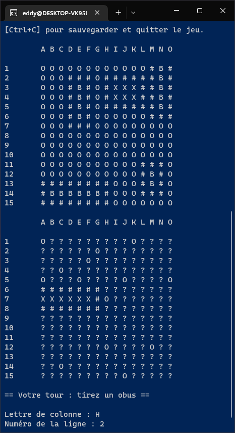

<div id="top"></div>

<!-- PROJECT LOGO -->
<br />
<div align="center">
  <h3 align="center">Battleship</h3>
  <p align="center">
    <a href="#">View Demo (TODO)</a>
  </p>
</div>

<!-- TABLE OF CONTENTS -->
<details>
  <summary>Table of Contents</summary>
  <ol>
    <li><a href="#about-the-project">About The Project</a></li>
    <li><a href="#context">Context</a></li>
    <li><a href="#built-with">Built With</a></li>
    <li><a href="#documentation">Documentation</a></li>
    <li><a href="#getting-started">Getting Started</a></li>
    <li><a href="#usage">Usage</a></li>
  </ol>
</details>

<!-- ABOUT THE PROJECT -->
## About The Project

<div align="center">
  
</div>
<br />

This project basic principle is: a reproduction of the existing game **[Battleship](https://en.wikipedia.org/wiki/Battleship_(game))** playable with a bot (no multiplayer).

### Features

- [x] Play with a bot.
- [x] Save the game to play later.
- [x] Game options are configurable.

<p align="right">(<a href="#top">back to top</a>)</p>

<!-- CONTEXT -->
## Context

This project is a personal project and it was my first steps with the C language and Linux programming.

<p align="right">(<a href="#top">back to top</a>)</p>

<!-- BUILT WITH -->
## Built With

Entire project was built with pure C and is only compatible with Linux.

<p align="right">(<a href="#top">back to top</a>)</p>

<!-- DOCUMENTATION -->
## Documentation

Doxygen docs can be generated in HTML by running `doxygen` command on file `doxy/Doxyfile` ([Doxygen](https://doxygen.nl/) must be installed on your system).

**Case symbols meaning:**

`O` : Water case.  
`#` : Water case that represents the boundary of a ship.  
`B` : Case containing the piece of a ship (should be hit).  
`X` : Piece of a ship destroyed.  
`?` : Not discovered case.

<!-- GETTING STARTED -->
## Getting Started

To get a local copy up and running follow the steps:

### Prerequisites

To compile the project, you will need:
* [Make](https://en.wikipedia.org/wiki/Make_(software))
```sh
apt-get install make
```

Optional dependency:
```sh
apt-get install doxygen
```

### Installation

1. Clone the repo:
   ```sh
   git clone https://github.com/Akwd22/bataille-navale.git
   ```
2. Compile the project:
   ```sh
   cd bin
   make
   ```

<p align="right">(<a href="#top">back to top</a>)</p>

<!-- USAGE EXAMPLES -->
## Usage

You can configure game options such as the size of the game board and the number of boats through launch parameters:
* `--help` to get the list of parameters:
```sh
Battleship

        Usage:
                ./main [options]
        Options:
                --help           Display the list of launch parameters.
                --lp <integer>   Length of the game board (between 5-25 included).
                --hp <integer>   Height of the game board (between 5-25 included).
                --tf <integer>   Fleet size (between 1-10 included).
```

<p align="right">(<a href="#top">back to top</a>)</p>
